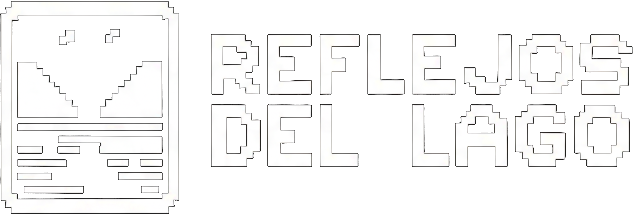

<div align=center>
  
</div>

<div align=center>
    
    
    
</div>

**Reflejos del lago** is a Geoguessr game of the province of Llanquihue. Try to guess where you are by looking just to a photo. Is it Puerto Varas?, Puerto Montt? Or maybe Llanquihue? Try your best and explore every corner of this beautiful land!

Play the game [here!](https://AlanSilvaaa.github.io/reflejos-del-lago/#/)

## Install

### Locally

> [!IMPORTANT]
> the project uses a `.env` file that is not commited to the repository for accessing the API keys. The instructions to create this file are on [this](./APIKEY.md) file.

First, clone the repository

```bash
git clone git@github.com:AlanSilvaaa/reflejos-del-lago.git
```

Then install the dependencies. Make sure you have `pnpm` installed.

```bash
pnpm install
```

To run the project, do:

```bash
pnpm run dev
```

Make sure you have the `.env` file with the correct API keys, otherwise the maps will display a bad version.

## Authors

- [@AlanSilvaaa](https://github.com/AlanSilvaaa)
- [@Vinbu](https://github.com/Vinbu)
